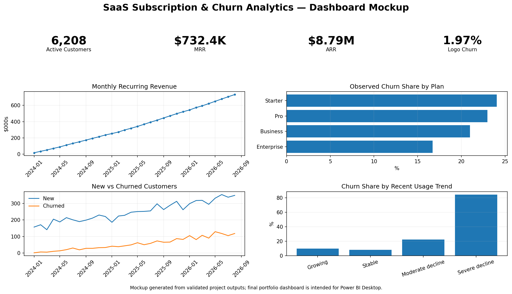

# SaaS Subscription & Churn Analytics

**PostgreSQL + Power BI portfolio project**

This project models a fictional SaaS company and answers a practical business question: **what is happening to recurring revenue and retention, and which customer behaviors are associated with churn?**

The repository includes a complete synthetic relational dataset, PostgreSQL schema and analysis scripts, Power BI-ready reporting views, DAX measures, dashboard specifications, validated outputs, and interview talking points.

> **Data note:** every customer and company record is synthetic. The project was designed for portfolio use, so it can be published publicly without exposing proprietary or personal data.



## Business problem

A SaaS leadership team wants a repeatable reporting workflow that can answer:

- How many customers are active and how much recurring revenue do they generate?
- How are MRR, customer acquisition, and logo churn changing over time?
- What does retention look like by signup cohort?
- Which plan types experience more churn?
- Do declining product usage, support burden, or payment failures appear alongside churn?
- Which active accounts show warning signals that customer success may want to review?

## Data model

The project uses six related source tables:

| Table | Grain | Rows |
|---|---|---:|
| `customers` | one row per account | 8,000 |
| `plans` | one row per plan | 4 |
| `subscriptions` | one row per account subscription | 8,000 |
| `usage_monthly` | one row per customer-month | 98,410+ |
| `support_tickets` | one row per support ticket | 20,500+ |
| `payments` | one row per payment attempt | 71,500+ |

The analysis period runs from **January 2024 through August 2026**.

## Skills demonstrated

### SQL
- relational schema design with primary/foreign keys
- data-quality and integrity checks
- multi-table joins
- CTEs
- conditional aggregation
- rolling 90-day and three-month feature windows
- date series with `generate_series`
- cohort retention analysis
- window functions (`LAG`, `ROW_NUMBER`, `DENSE_RANK`)
- BI-oriented reusable views

### Power BI
- star-like semantic model
- Date dimension
- DAX measures for MRR, ARR, ARPA, churn, payment failures, CSAT, and risk signals
- executive KPI design
- cohort-retention matrix
- behavioral churn-driver visuals
- customer risk explorer
- drill/filter design by plan, segment, country, industry, and channel

## Validated portfolio results

At the August 31, 2026 snapshot:

| KPI | Result |
|---|---:|
| Active customers | **6,208** |
| Current MRR | **$732,430.75** |
| Current ARR | **$8,789,169.00** |
| Current ARPA | **$117.98 / month** |
| August 2026 logo churn | **1.97%** |
| Customers ever acquired | **8,000** |

Selected retention and churn findings:

- Average month-6 cohort retention is roughly **88.9%**.
- Average month-12 cohort retention is roughly **78.9%**.
- Starter has an observed churn share of about **24.0%**, compared with about **16.7%** for Enterprise.
- Customers with a **severe recent usage decline** have an observed churn share of about **84.1%**, versus roughly **8.0%** among customers with stable recent usage.
- Customers with **4+ support tickets in the trailing 90 days** have an observed churn share of about **61.6%**.
- Customers with a **recent failed payment** have an observed churn share of about **49.5%**, compared with about **20.0%** without one.
- Among churned customers, average sessions fall from roughly **77–78 sessions** six-to-three months before cancellation to about **43 sessions** in the churn month.

These figures are **descriptive associations in synthetic data**, not causal estimates.

## SQL workflow

Run the PostgreSQL scripts in order:

```text
sql/01_create_schema.sql
sql/02_load_data.sql
sql/03_data_quality.sql
sql/04_customer_health_features.sql
sql/05_kpi_analysis.sql
sql/06_retention_cohorts.sql
sql/07_churn_drivers.sql
sql/08_powerbi_views.sql
sql/09_interview_queries.sql
```

Example from the customer-health layer:

```sql
SELECT
    customer_id,
    status,
    avg_sessions_last_3m,
    usage_change_last_3m,
    tickets_last_90d,
    failed_payments_last_90d
FROM saas_analytics.vw_customer_health
ORDER BY usage_change_last_3m;
```

The project deliberately keeps the raw entity tables separate from reporting views so the Power BI model can show both **data modeling** and **analytics engineering** skills.

## Power BI dashboard

The supplied dashboard specification contains four pages:

1. **Executive Overview** — active customers, MRR, ARR, ARPA, logo churn, MRR trend, new vs churned customers, plan performance.
2. **Retention & Cohorts** — cohort matrix, retention curve, month-6/month-12 retention, acquisition-channel comparison.
3. **Churn Drivers** — usage decline, support burden, failed payments, cancellation reasons, usage before churn.
4. **Customer Risk Explorer** — account-level table with usage, tickets, failed payments, MRR, plan, and risk formatting.

See `powerbi/dashboard_build_guide.md` and `powerbi/measures.dax`.

## How to run it

### 1. Create the database

Create a PostgreSQL database, for example:

```bash
createdb portfolio
psql -d portfolio -f sql/01_create_schema.sql
psql -d portfolio -f sql/02_load_data.sql
psql -d portfolio -f sql/03_data_quality.sql
psql -d portfolio -f sql/04_customer_health_features.sql
psql -d portfolio -f sql/05_kpi_analysis.sql
psql -d portfolio -f sql/06_retention_cohorts.sql
psql -d portfolio -f sql/07_churn_drivers.sql
psql -d portfolio -f sql/08_powerbi_views.sql
```

`02_load_data.sql` uses `psql`'s `\copy` command, so run it from the repository root.

### 2. Connect Power BI Desktop

Choose **Get Data → PostgreSQL database**, then import the raw tables and the reporting views documented in `powerbi/POWERBI_IMPORT_GUIDE.md`.

### 3. Add the model and measures

- Create the Date table from `powerbi/date_table.dax`.
- Add the relationships from `powerbi/model_relationships.md`.
- Add the measures from `powerbi/measures.dax`.
- Build the pages described in `powerbi/dashboard_build_guide.md`.

## Repository structure

See [`docs/project_structure.md`](docs/project_structure.md) for the full tree.

## Why the data is synthetic

A public portfolio should be reproducible and shareable. Synthetic data lets this project demonstrate realistic SQL and BI workflows without licensing issues or confidential customer information. The generation and validation code is included under `python/` so the dataset's origin is transparent and the summary outputs can be reproduced.

The data intentionally contains statistical patterns — lower engagement, heavier support burden, and failed payments are associated with churn — but noise and non-behavioral churn are included so the result is not perfectly deterministic.

## Limitations and next steps

A production SaaS model would additionally separate voluntary and involuntary churn, support subscription upgrades/downgrades and expansion/contraction MRR, use event-level product telemetry, incorporate seat utilization, validate metric definitions against finance systems, and evaluate any predictive churn model on a time-based holdout set.

## Portfolio summary

**SaaS Subscription & Churn Analytics | PostgreSQL, Power BI**  
Built a relational SaaS analytics model covering 8,000 customer accounts and 190K+ usage, billing, and support records. Developed SQL pipelines for recurring-revenue KPIs, cohort retention, rolling customer-health signals, and churn analysis, then designed a four-page Power BI reporting model with reusable views and DAX measures.
