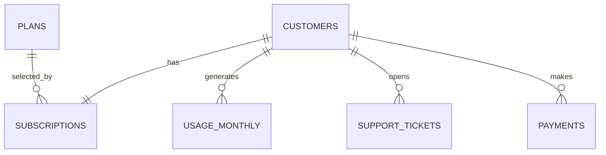

# Power BI Data Model

Use a star-like model with `Customers` and `Plans` as dimensions and the event tables as facts.

## Relationships

| From | Column | To | Column | Cardinality | Filter direction |
|---|---|---|---|---|---|
| Customers | customer_id | Subscriptions | customer_id | 1:1 | Single |
| Plans | plan_id | Subscriptions | plan_id | 1:* | Single |
| Customers | customer_id | Usage_Monthly | customer_id | 1:* | Single |
| Customers | customer_id | Support_Tickets | customer_id | 1:* | Single |
| Customers | customer_id | Payments | customer_id | 1:* | Single |

For the portfolio build, also import the database views `vw_customer_360`, `vw_monthly_business_metrics`, and `vw_usage_before_churn`. Treat these as reporting tables; avoid creating ambiguous bidirectional relationships to the raw fact tables.

Create the DAX Date table in `date_table.dax`. Mark it as the model's Date table. For the main historical trend page, relate `Date[Date]` to `vw_monthly_business_metrics[month_start]` as a one-to-many relationship.
